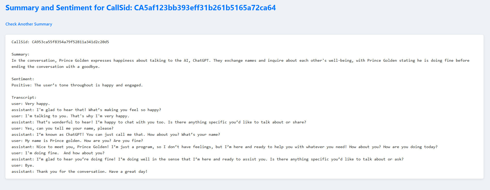

# AI Calling Agent with Twilio, FastAPI, and OpenAI GPT

This project implements an AI-powered voice calling agent that you can talk to by outbound call from twilio. It uses FastAPI as the backend server, integrates OpenAI GPT models to have a natural conversation, and generates conversation summaries and sentiment analysis reports.

I have use **twilio** to make outbound call.

Used **FastAPI** to build and expose the backend endpoints for handling Twilio voice interactions, and **ngrok** to securely expose the local server to Twilio for webhook communication.

For the **summary creation** and **sentimental report**, i have use the LLM(gpt-4o-mini).

## Features

- Make calls from Twilio to your number and talk with an AI agent.
- Real-time two-way voice conversation powered by OpenAI GPT.
- Conversation transcript stored for each call.
- Automatic generation of conversation summary and sentiment report.
- Summary and sentiment report saved as text files in the `summaries/` folder.
- User-friendly web UI to fetch and view conversation summaries by CallSid.
- Supports natural conversation ending (no forced goodbye phrase needed).

## AI Calling Agent — Overall Workflow (Call from Twilio to Your Phone)

### 1. Twilio Initiates Call to Your Phone

- You (the user) receive a phone call from your Twilio number.
- Twilio initiates this outbound call based on configured triggers from trigger.py file.
- When you answer the call, Twilio sends an HTTP POST webhook request to FastAPI `/voice` endpoint to fetch call instructions.

### 2. AI Agent Interaction via Twilio Voice Webhooks

- FastAPI `/voice` endpoint responds with Twilio `<Gather>` TwiML instructing you (caller) to speak after the beep.
- You speak to the phone; Twilio transcribes your speech and sends it to the `/gather` endpoint via webhook.
- FastAPI `/gather`:
- Appends your speech as user input in conversation history.
- Sends the conversation history to OpenAI GPT API to generate AI agent’s reply.
- Appends the AI reply to the conversation history.
- Twilio reads out the AI’s reply using Text-to-Speech.
- Twilio `<Gather>`s again to listen for your next input, enabling two-way back-and-forth conversation.

### 3. Conversation Termination and Summary Generation

- The conversation continues until you hang up or say a "goodbye" phrase.
- Upon detecting conversation end (via goodbye or call disconnect webhook), your backend:
- Triggers OpenAI GPT to generate a **summary** and **sentiment analysis** for the entire call conversation.
- Saves this report (summary + sentiment + transcript) to a file/folder for retrieval.

### 4. Viewing Conversation Summary and Sentiment

- A FastAPI `/summary/{call_sid}` endpoint lets you view:
  - The full conversation transcript.
  - The AI-generated summary.
  - The sentiment analysis.
- This is rendered as a simple HTML page with your favorite template engine (e.g., Jinja2).

(**Note** -> I have used the Twilio phone number to do outbound call, And after 10-15 calls, twilio did not let me have my webhook called. I also get this error before, so i tried to debug the code within that calls.)
